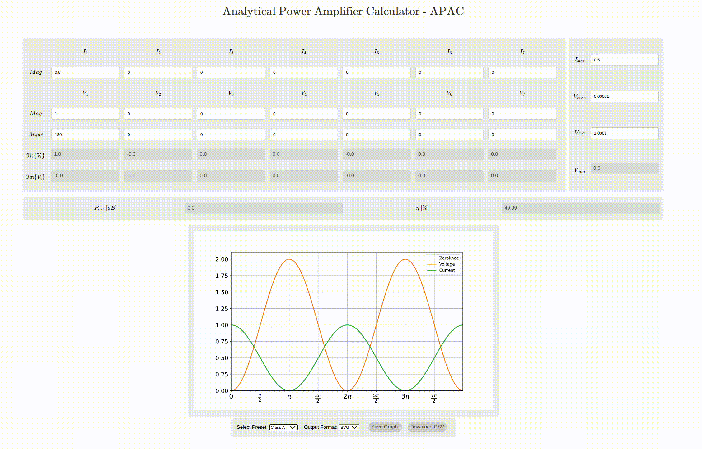

# PAWaves: Python RF Power Amplifier Waveform Postulator

**PAWaves** is a Python-based calculator designed to model and analyze voltage and current waveforms in RF power amplifiers (RFPAs). It operates as a "postulator," enabling users to input and explore waveform conditions consistent with device IV characteristics, rather than simulating entire circuits. By allowing the user to define input conditions such as current, voltage, and harmonic components, PAWaves calculates the resulting impedances required to sustain these waveforms across the fundamental, second, and third harmonics.

## Key Features

- **User-guided postulation of waveforms**: Instead of relying on heavy computation or device models, users postulate the waveforms, and PAWaves evaluates their feasibility.
  
- **Impedance calculations**: It determines the impedance values needed to sustain the inputted waveforms, requiring users to make realistic assumptions and eliminate resistive or negative real parts for valid results.
  
- **RF output analysis**: The program computes normalized dB values for RF output power, efficiency, and implied harmonic impedances.
  
- **Interactive waveform modeling**: The user inputs parameters like bias current (`Ibias`), signal current (`Isig`), and harmonic voltage components to visualize the effects on power and efficiency. For example, increasing or adjusting knee voltage (`Vknee`) allows users to study the impact of device knee characteristics on the waveforms.
  
- **Harmonic exploration**: PAWaves allows exploration of second and third harmonic voltage conditions, simulating modes like Class F and Class J, with visual feedback via impedance plots to ensure voltage and current remain 90° apart to prevent negative resistance.

PAWaves is particularly useful for investigating second harmonic enhancement, power efficiency improvements, and other waveform manipulations in RF amplifier design.



# Development
Create a virtual environment: `python -m venv ./.venvs/pawavesvenv` and activate it `source <path-to-venv>/bin/activate`.

Install requirements: `pip install -r requirements.txt`.

`cd` in the directory that contains the `manage.py` file (root). Start the web server by running `python manage.py runserver`. You can now see changes in your site by going to `http://127.0.0.1:8000/`.

When you edit any static files (i.e css, js, presets) you need to apply them with `python manage.py collectstatic`.

# Deploying
Upload code to git.

Then, in a [PythonAnywhere console](https://www.pythonanywhere.com/consoles/) run:
```
cd ~/<your-pythonanywhere-domain>.pythonanywhere.com
git pull
```

Activating your virtualenv if it's not still active from earlier (PythonAnywhere uses a command called workon to do this, it's just like the source myenv/bin/activate command you use on your own computer):

```
workon <your-pythonanywhere-domain>.pythonanywhere.com
python manage.py collectstatic
```
Then go to the ["Web" page](https://www.pythonanywhere.com/web_app_setup/) and hit Reload. Changes should now be visible.

# Todos
- [ ] Adjust to different screen sizes.